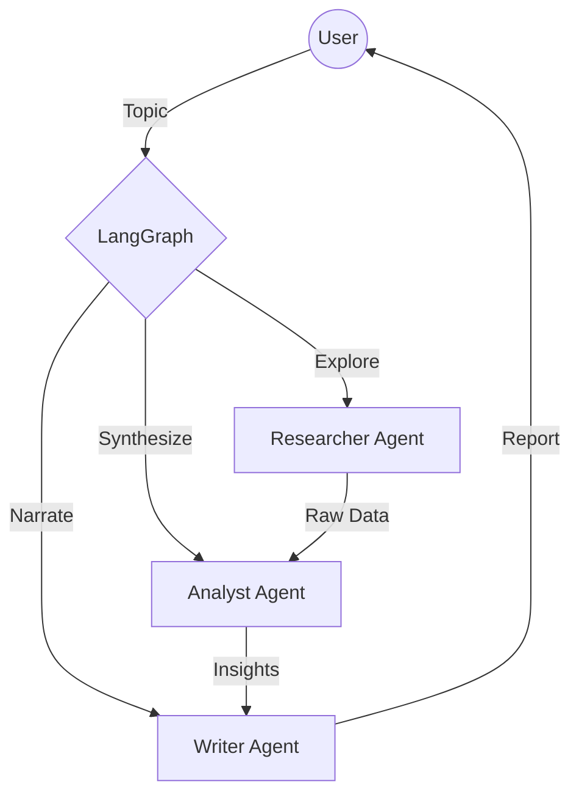

# CLAUDE.md - The Ultrathink Constitution

> **"We're not here to write code. We're here to make a dent in the universe."**

This file is the single source of truth for the philosophy, architecture, and standards of the **Agentic Market Research Orchestrator**. It is not a suggestion. It is the law.

## I. The Philosophy (Ultrathink)

1.  ✅ **Think Different**: Question every assumption. If the code looks "standard," it's probably wrong. Look for the elegant angle capable of 80x improvements.
2.  ✅ **Craft, Don't Code**: Variable names explain. Functions sing. The code is literature for the next engineer.
3.  ✅ **Simplify Ruthlessly**: Complexity is the enemy. If a feature doesn't add exponential value, delete it.
4.  ⭐ **Iterate Relentlessly**: The first draft is for the trash. The second is for the critic. The third is for the user.

## II. The Architecture

The system is a **Symbiotic Triad** orchestrated by `LangGraph`.



### The Agents
*All agents must inherit from `src.agents.base.BaseAgent`.*

1.  **The Researcher (`src/agents/researcher.py`)**
    *   **Role**: The Hunter.
    *   **Behavior**: Deep, recursive searching. Never satisfied with the first search result. Verifies sources.
    *   **Output**: Verified, raw data points with citations.
2.  **The Analyst (`src/agents/analyst.py`)**
    *   **Role**: The Strategist.
    *   **Behavior**: Ruthless synthesis. Looks for patterns, gaps, and SWOT elements. Does NOT just summarize; creates *meaning*.
    *   **Output**: Structured insights, contradictions, and strategic opportunities.
3.  **The Writer (`src/agents/writer.py`)**
    *   **Role**: The Storyteller.
    *   **Behavior**: Clear, professional, executive-level prose. No fluff.
    *   **Output**: The final Markdown report that "wows" the user.

## III. Coding Standards

### Python (The Core)
*   ✅ **Version**: 3.12+
*   ✅ **Style**: Strict `ruff` compliance.
*   ✅ **Typing**: Static typing is mandatory. No `Any` unless legally unavoidable. Use `src.workflows.types` for shared models.
*   ✅ **Async**: The world is asynchronous. Use `greenlet` / `asyncio` patterns via FastAPI.

### Patterns
*   ✅ **State Management**: Use `TypedDict` for LangGraph state (see `src/workflows/types.py`).
*   ✅ **Configuration**: All prompts and model configs live in `src/utils/prompts/` or environment variables. No magic strings in code.
*   ⭐ **Error Handling**: Fail gracefully. Agents should report "Intelligence Gaps" rather than crashing.

## IV. Commands & Workflows

### Setup
```bash
python -m venv venv
source venv/bin/activate
pip install -r requirements.txt
```

### Testing (The Gauntlet)
Run the full suite. If this fails, you do not push.
```bash
./scripts/run_all_tests.sh
```

### Docker
```bash
docker-compose up --build
```
